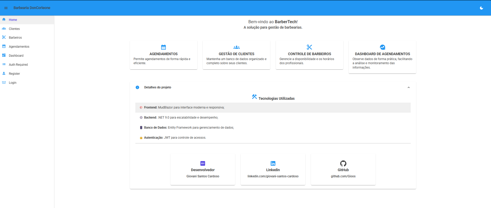

**BarberTech**

Aplicação para o gerenciamento de clientes, barbeiros e agendamentos em uma barbearia. Desenvolvido com MudBlazor e .NET 9, acesso ao banco de dados SQL Server com Entity Framework. O sistema oferece uma interface responsiva e intuitiva, permitindo o controle eficiente dos serviços prestados.

##

**Tecnologias Utilizadas**

⚙️ .NET 9 - Backend robusto e escalável

🎨 MudBlazor - Interface responsiva e moderna

🗃️ Entity Framework Core - Gerenciamento de dados

🔐 Autenticação JWT - Controle de acessos e permissões

🗄️ Banco de Dados - SQL Server
##

**Funcionalidades**

✅ Cadastro, edição e exclusão de clientes e barbeiros

✅ Gerenciamento de agendamentos e horários

✅ Controle de serviços oferecidos

✅ Sistema de permissões para diferentes tipos de usuários

✅ Dashboard com estatísticas da barbearia
